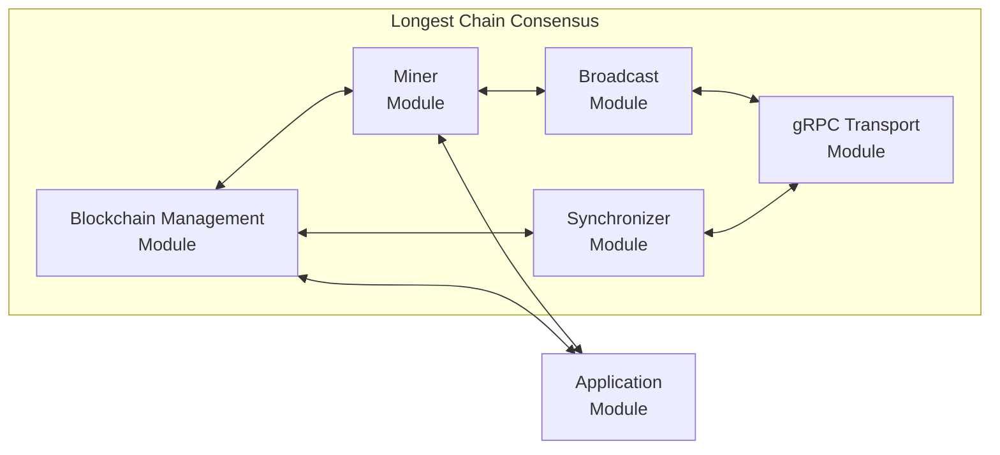
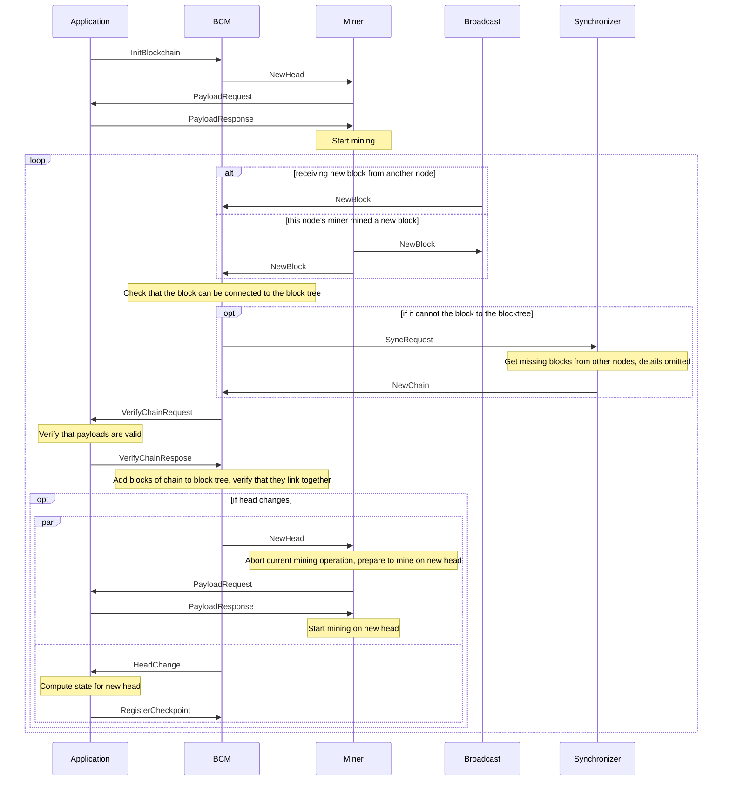
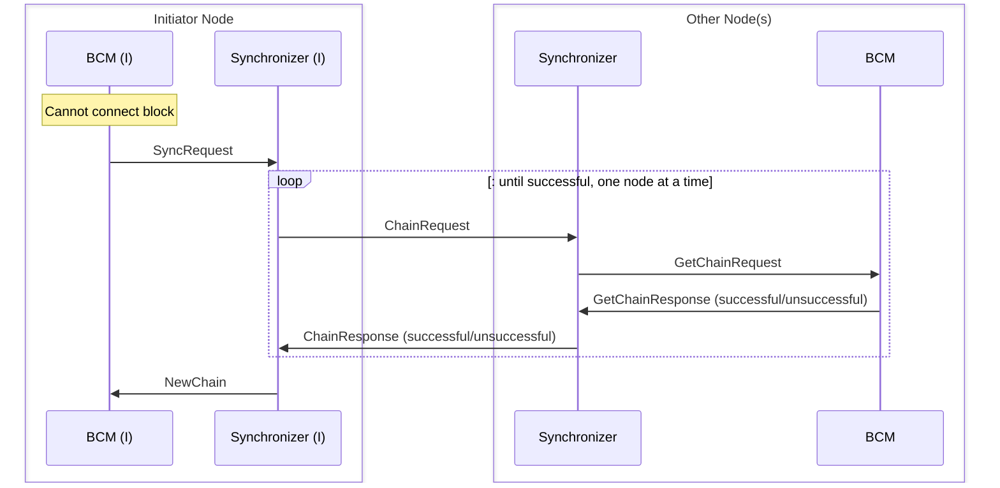
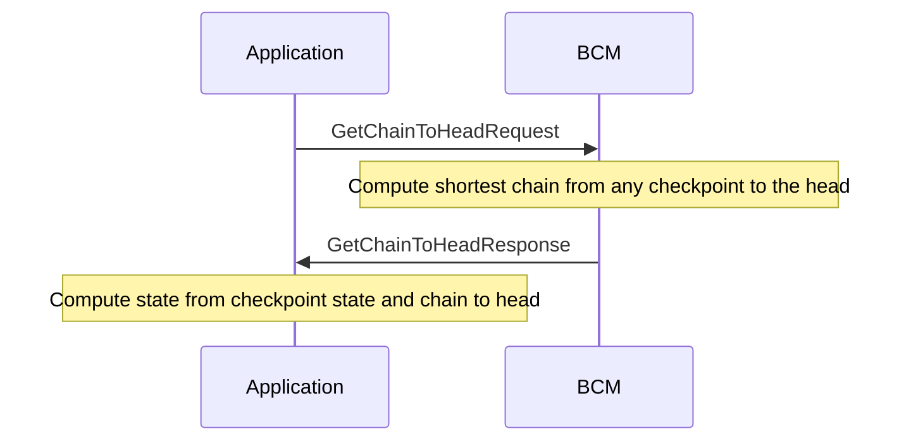
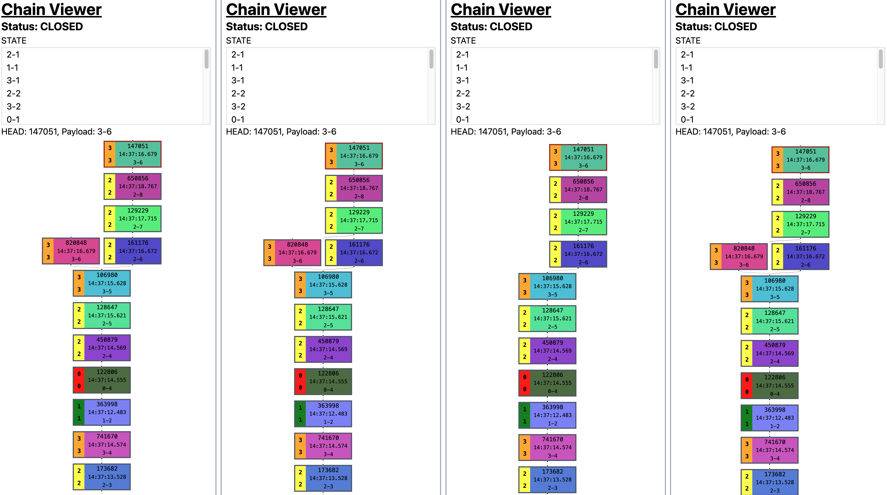
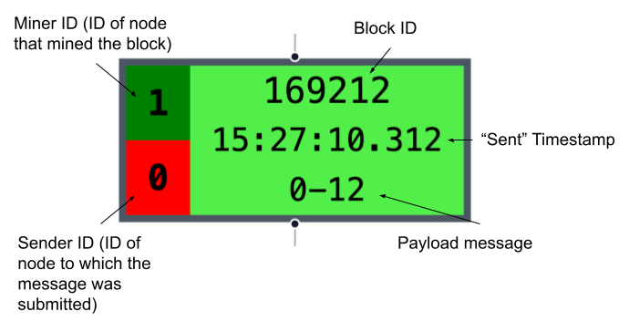

# Blockchain System

This "Blockchain System" is a modular implementation of a longest-chain consensus protocol modeling proof-of-work.

The goal of this system is to provide a simple modular blockchain run on a fixed set of nodes.

It provides the core elements with only the actual business logic to be implemented by an application module.

> #### Important
>
> This system is only intended for **demonstration purposes**.

## Overview

We will first outline the different parts that make up the system.
How these elements interact with each other will be described in [Operation](#operation) and a more detailed description of every element can be found in [Modules](#modules).

Each node has a set of core modules running the blockchain and an application module that runs the business logic and provides certain functionality to the core modules.

The blocks making up the blockchain contain the following:

- **block id:** Identifier of a block, computed by hashing the block with the block id set to 0.
- **previous block id:** Identifier of the predecessor block.
- **payload:** An application dependant payload.
- **timestamp:** Timestamp of when the block was mined.
- **miner id:** Identifier of the node that mined the block.

Every node keeps track of all nodes that it knows of.
At the very beginning, this is solely the genesis block.
After a couple of blocks have been mined, all nodes together form a tree of blocks.
Whichever leaf of this tree is the deepest is called the head and the chain of blocks from the genesis block to this leave is the canonical chain.
The payloads of all the blocks in the canonical chain together define the current state stored in the blockchain.



The nodes consist of the following core modules:

- **Blockchain Management Module (BCM):**
  It forms the core of the system and is responsible for managing the blockchain.

- **Miner Module:**
  Mines new blocks by simulating proof-of-work.

- **Synchronizer Module:**
  Resolves issues when new blocks are to be added to the blockchain but their parent blocks are unknown to this node's BCM.

- **Broadcast Module:**
  Broadcasts newly mined blocks to all other nodes.
  It can also simulate network delay and dropped messages.

and the following supporting modules (provided by mir):

- **gRPC Transport Module:**
  Used for communication between nodes.

- **Event Mangler Module:**
  Used by the broadcast module to simulate network delay and dropped messages.

- **Timer Module:**
  Used by the Miner to simulate proof-of-work.

Lastly, a user-implemented **Application Module** handles all business logic.
In particular, it needs to compute the state of the blockchain, verify transactions and provide transactions to the miner.

Next to the modules, it also includes an interceptor that intercepts all communication between different modules and allows for visualization/debugging tools to consume this communication via a websocket connection.
An example of how to use the information provided by the interception can be found [here](https://github.com/komplexon3/longest-chain-project/tree/main/chain-visualizer).

(Note that the event mangler module and the timer module were omitted from the diagram above for simplicity.)

## Operation

We will now walk through how the different modules interact with each other.
At the start, the application module must initialize the BCM by sending it an _InitBlockchain_ event which contains the initial state.
The BCM creates a genesis block with an empty payload and stores it together with the initial state.
It then instructs the miner module to start mining via a _NewHead_ event.
In order to start mining, the miner module requests a payload (_PayloadRequest_) from the application module.
The miner now starts to mine and the initialization sequence of the node is completed.

After this, the node will remain inactive (other than mining a block) until a new block has been mined.
This block was either mined by this node's miner or by another node's miner.
In the first case, the miner would send the new block to its BCM and broadcast the block to all other nodes via the broadcast module (_NewBlock_ event).
In the second case, the broadcast module would have received the block from the other node's broadcast module and sent it to the BCM as a _NewBlock_ event.

The BCM will then check whether or not it can connect this block to its tree of blocks.
If it cannot connect the block, we call it an orphan block.
Such cases can occur if the block's parent was mined by another node and the broadcast message for this block has not (yet) reached this node.
The BCM will try to resolve these problems with the help of the synchronizer, which will coordinate with other nodes to get the missing blocks.
This procedure will be described in more detail below.

The BCM now potentially has multiple blocks to add, which are the new block and possibly a chain of additional blocks from the synchronizer.
The blocks are not trusted by the BCM as they might have been mined by another node and must, therefore, be verified.
This happens in two ways:

1. The BCM sends all the blocks together with some additional information to the application module (_VerifyChainRequest_).
   The application then verifies that the payloads are valid.
   This logic is application-specific.
2. The BCM verifies that the nodes link together correctly.

The BCM can now add all new blocks to the block tree.
If the canonical chain changes, i.e., there is a new head, it instructs the miner to start mining on the new head (_NewHead_ event).
Also, it informs the application about the new head (_HeadChange_ event).
This event contains some additional information about how the canonical chain changes.
For example, if a different branch of the tree is now the canonical chain, it also includes which blocks are no longer part of the canonical chain.
This allows for the application to resubmit these payloads if desired.
In any case, the application will compute the state corresponding to the new head and register it in the BCM (_RegisterCheckpoint_).

**Note**: In the sequence diagrams, the boxes with a dotted outline have a different meaning depending on the label in the top left corner:

- loop: The sequence in the box repeats indefinitely or until the condition in the brackets holds.
- alt: The two boxes making up this box describe two alternative sequences.
- opt: The sequence in the box is optional.
  It is performed if the condition in the boxes holds.
- par: The two boxes making up this box describe two sequences that are performed in parallel.



The functionality of the synchronizer was already outlined above.
This part will go into more detail on how the synchronizer resolves orphan blocks.
Every _SyncRequest_ from the BCM contains the id of the orphan block and a collection of id of the block that the BCM has in its tree.
With this information, the synchronizer asks one node after another to give it a chain that connects the orphan block to one of the known blocks (_ChainRequest_).
The other nodes' synchronizers then query their BCM via a _GetChainRequest_ for such a segment and forward the answer back to the initiator's synchronizer.
The responses can be unsuccessful.
In that case, the synchronizer asks the next node.
When a successful response is received, the synchronizer instructs the BCM to add the new chain to the block tree (_NewChain_ event).



At any point in time, the application can get the current state at the head of the blockchain by sending a _GetChainToHeadRequest_ to the BCM.
The response to this will include a chain of blocks from a checkpoint to the current head and the state associated with the checkpoint.
Using this information, the application can compute the current state.



## Modules

After outlining the modules that make up a node and describing how they interact with each other, the following will describe the modules' functionality in a bit more detail.

### Blockchain Management Module (BCM)

The blockchain manager module is responsible for managing the blockchain.
It keeps track of all blocks and links them together to form a tree.
In particular, it keeps track of the genesis block, the head of the blockchain, all leaves, and so-called checkpoints.
A checkpoint is a block stored by the BCM that has a state stored with it.
Technically, checkpoints are not necessary as the state can be computed from the blocks.
However, it is convenient to not have to recompute the state from the genesis block every time it is needed.

The BCM must perform the following tasks:

1. Initialize the blockchain by receiving an _InitBlockchain_ event from the application module which contains the initial state that is associated with the genesis block.
2. Add new blocks to the blockchain. If a block is added that has a parent that is not in the blockchain, the BCM requests the missing block from the synchronizer.
   Blocks that are missing their parent are called orphans.
   All blocks added to the blockchain are verified in two steps:

   - It has the application module verify that the payloads are valid given the chain that the block is part of.
   - The BCM must verify that the blocks link together correctly.

   Additionally, it emits a _TreeUpdate_ event. This is solely for debugging/visualization purposes and is not necessary for the operation of the blockchain.

3. Register checkpoints when receiving a _RegisterCheckpoint_ event from the application module.
4. Provide the synchronizer with chains when requested. This is to resolve orphan blocks in other nodes.
5. When the head changes, it sends a _HeadChange_ event to the application module.
   This event contains all information necessary for the application to compute the state at the new head as well as information about which payloads are now part of the canonical (i.e., longest) and which ones are no longer part of the canonical chain.
   Also, it instructs the miner to start mining on the new head (_NewHead_ event).
6. Provide a chain of blocks from a checkpoint to the current head and the state associated with the checkpoint when receiving a _GetChainToHeadRequest_.
   This is used by the application to query the current state.

### Miner Module

The miner module is responsible for mining new blocks.
It simulates the process of mining a block by waiting for a random amount of time and then broadcasting the mined block.
This random amount of time is sampled from an exponential distribution with a mean of `expMinuteFactor` minutes.
The mining is orchestrated by a separate goroutine (`mineWorkerManager`) such that the miner module can continue to receive and process events.

The operation of the miner module at a is as follows:

1. When it is notified of a new head (_NewHead_ event), it prepares to mine the next block by sending a PayloadRequest event to the application module.
   If it is already mining a block, it aborts the ongoing mining operation.
2. When it receives the PayloadResponse containing a payload for the next block, it starts mining a new block with the received payload.
3. When it mines a new block, it broadcasts it to all other modules by sending a _NewBlock_ message to the broadcast module.
   It also shares the block with the blockchain manager module (BCM) by sending a _NewBlock_ event to it.

### Broadcast Module

The broadcast module is responsible for broadcasting new blocks to all other nodes.
It either does this directly via the transport module or the mangler (parameter mangle).
If the mangler is used, messages might be dropped and delayed.
How many messages should be dropped can be configured by the parameter `dropRate` and the delay can be configured by the parameters `minDelay` and `maxDelay`.

### Synchronizer Module

The synchronizer module assists the blockchain manager (BCM) in resolving cases when BCM receives an orphan block.
An orphan block is a block that cannot be linked to the blockchain because the blockchain does not contain the block that the orphan block is linked to.
To do this, the synchronizer module communicates with other nodes to get the missing blocks.

Terminology:

- internal sync request: a request to synchronize a chain segment that was initiated by this node
- external sync request: a request to synchronize a chain segment that was initiated by another node

The synchronizer module performs the following tasks:

For internal sync requests:

1. When it receives a _SyncRequest_ event, it must register the request and send a _ChainRequest_ message to one of the another nodes.
2. When it receives a successful _ChainResponse_ message, it sends the blockchain manager (BCM) the chain fixing the missing bit with a _NewChain_ event.
   It then deletes the request.
3. When it receives an unsuccessful _ChainResponse_ message, it sends a _ChainRequest_ message to the next node.
   If there are no more nodes to ask, it deletes the request.

For external sync requests:

1. When it receives a _ChainRequest_ message, it must register the request and send a _GetChainRequest_ event to the BCM.
2. The BCM will respond with a _GetChainResponse_ event.
   The synchronizer then responds to the node that sent the _ChainRequest_ message with a _ChainResponse_ message.

**IMPORTANT:**
This module assumes that all other nodes respond to requests.
For this reason, the messages sent from the synchronizer do not go through the mangler.

### Application Module

The application module is responsible for performing the actual application logic and interacting with users.
It does not hold any persistent state but instead relies on the blockchain manager module (BCM) to store the state.
However, the application is responsible for computing the state given a chain of blocks and a state associated with the first block in the chain.
Also, the application module manages payloads and must provide payloads for new blocks to the miner.

The application module must perform the following tasks:

1. Initialize the blockchain by sending the initial state to the BCM in an _InitBlockchain_ event.
2. When it receives a _PayloadRequest_ event, it must provide a payload for the next block.
   Even if no payloads are available, a payload must be provided, however, this payload can be empty.
3. When it receives a _HeadChange_ event, it must compute the state at the new head of the blockchain.
   This state is then registered with the BCM by sending it a _RegisterCheckpoint_ event.
   A checkpoint is a block stored by the BCM that has a state stored with it.
4. When it receives a _VerifyBlocksRequest_ event, it must verify that the given chain is valid at an application level and respond with a _VerifyBlocksResponse_ event.
   Whether or not the blocks link together correctly is verified by the BCM.

An example of such an application is the [Blockchain Chat App](../../samples/blockchain-chat/) that is in the samples directory.
As the name implies, it implements a simple chat application.

### Websocket Interceptor

The websocket interceptor intercepts all events and sends them to a websocket server.
Any connected client can then receive these events by subscribing to the websocket server.
The interceptor proto file defines events that are specifically intended for the interceptor and not used by the actual blockchain.
Since these events technically don't have a destination module, they are sent to the "null" module (a module that simply ignores all incoming events).
However, all events are intercepted and sent to the websocket server.
The interceptor proto is simply for "extra" events.

The interceptor proto defines two such dedicated events:

- _TreeUpdate_: This event is sent by the blockchain manager (BCM) when the blockchain is updated.
  It contains all blocks in the blockchain and the id of the new head.
- _StateUpdate_: This event is sent by the application when it computes the state for the newest head of the blockchain.

**Important note:**
This is a very simple implementation and it fails to properly handle connections which causes a crash when subscribers disconnect.

## How to use the system

To use the blockchain system, you must first define your application's state and payloads in `statepb.proto` and `payloadpb.proto` files.

Next, you must implement an application module that performs the following actions:

1. Initialize the blockchain by sending an initial state as an _InitBlockchain_ event to the BCM.
2. When it receives a _PayloadRequest_ event, it must provide a payload for the next block.
   Even if no payloads are available, a payload **must** be provided.
   However, this payload can be empty.
3. When it receives a _HeadChange_ event, it must compute the state at the new head of the blockchain.
   This state must then be registered with the BCM by sending it a _RegisterCheckpoint_ event.
   Additionally, the information provided in the _HeadChange_ event might be useful for the payload management.
4. When it receives a _VerifyBlocksRequest_ event, it must verify that the given chain is valid at an application level and respond with a _VerifyBlocksResponse_ event.

See the example blockchain chat app as a reference.

You can now set up all the modules using `system.New(...)` where you can configure the system and provide it with your application module.
For the node initialization, you can get all modules of the system by calling `system.Modules()`.

## Example: Blockchain Chat App

An example of how to use the longest-chain consensus system is the [Blockchain Chat App](../../samples/blockchain-chat/).
Users can enter input through standard input line by line and the system replicates all messages in the same order across all nodes.
It enforces that all messages sent from the same sender appear in the history in a monotonically increasing order of submission time.

### Specification of the Chat App

The following lists the key specifications of the chat app:

- **Payload:**
  The payloads consist of a message, the sender id (id of the node from which the message was sent) and a submission ("sent") timestamp.

- **State:**
  The state consists of the message history and a collection of "last sent" timestamps, one for each sender, where the timestamp corresponds to the submission time of the last message of this sender.

- **Applying blocks to compute state:**
  When applying a block to a state, the message in the payload is appended to the message history and the "last sent" timestamp corresponding to the sender is updated.

- **Verifying blocks:**
  To verify a block, the application verifies that the "sent" timestamp of the payload is not before the "last sent" timestamp of the sender stored in the state associated with the block's parent block.

- **Providing payloads:**
  Each node's application keeps track of all messages that were submitted to it.
  Additionally, if a fork happens and the branch changes, it re-adds payloads that were previously part of the old canonical chain to its payload pool and removes the ones that are now part of the canonical chain.
  If no payloads are available, it simply provides an empty payload.

### Running the chat app

To run the chat app, you can run the following in multiple terminals, once for each node

```
go run . -numberOfNodes <number of nodes in the network> -nodeID <id of this node [0, numberOfNodes-1]>
```

Further, you can add the following options to modify the characteristics of the system(s).
If they are not set, default values will be used

- **-disableMangle:**
  Disables all mangling of the messages between the nodes.
- **-dropRate:** The rate at which to drop messages between nodes. (Ignored if _disableMangle_ is set.)
- **-minDelay:** The minimum delay by which to delay messages between nodes. (Ignored if _disableMangle_ is set.)
- **-maxDelay:** The maximum delay by which to delay messages between nodes. (Ignored if _disableMangle_ is set.)
- **-expMiningFactor:** Factor for exponential distribution for random mining duration.

If `tmux` is installed, you can run `./run.sh` to start a network of 4 nodes with reasonable options set.

### Visualization

For this chat application, there exists an accompanying browser-based visualization tool that utilizes the aforementioned websocket interceptor.
The visualizer provides insight into the state of the different nodes.
In particular, it displays the block tree stored in every node, the current and the current chat/message history (i.e., state corresponding to the current head).

This information is shown once for each node.
In the box at the top, you see the chat/message history.
Right below it, you can see the id of the current head (truncated for readability) and the message part of the head's payload.
The biggest part of the window is filled with the block tree that is stored by the node's BCM.
It shows how the blocks are connected and the current head is marked with a red border.
To more easily compare the trees, each block's background color is derived from its id.



Every single block displays the following information:

- **Block ID:**
  The id of the block (truncated for readability).
- **Miner ID:** The id of the node that mined the block.
  The background color is unique per id.
- **Sent Timestamp:**
  The time at which the message was sent.
  This information is part of the payload.
  Not to be confused with the time at which the block was mined.
- **Payload Message**:
  The message that is part of the payload.
- **Sender ID:**
  The id of the node from which the message was sent.
  Again, the background is unique per id.
  Note that this information is part of the payload.



## Conclusion
