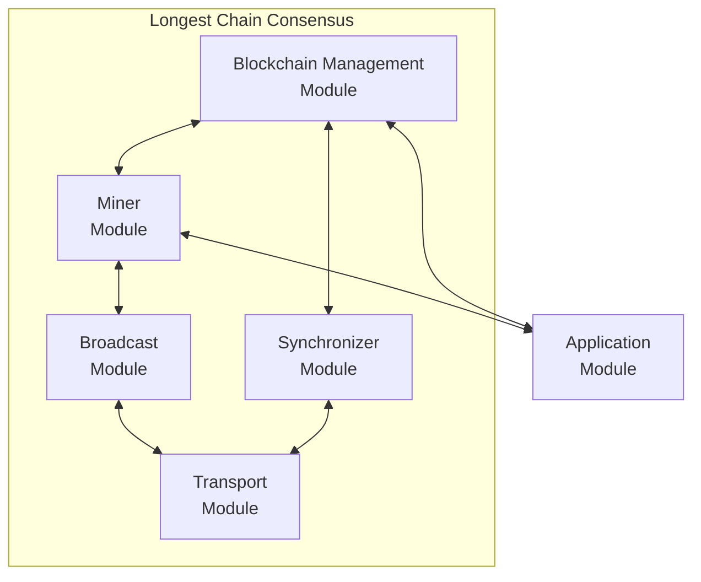
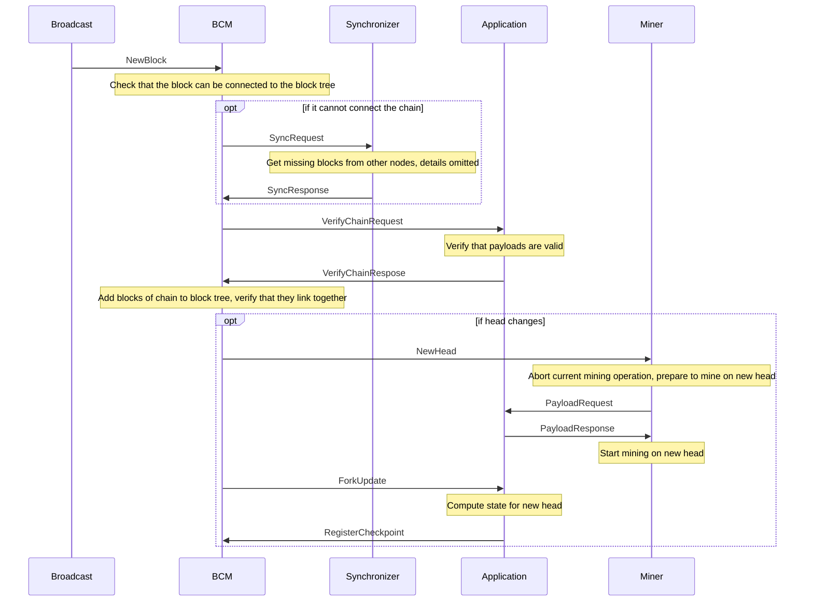

# Longest Chain Consensus

LCC is a modular implementation of a longest chain consensus protocol modelling proof-of-work.

It provides the core elements with only the actual buisiness logic to be implemented by an application module.

It consists of the following core modules:

- **Blockchain Management Module (BCM)**

  It forms the core of the system and is responsible for managing the blockchain.

- **Miner Module**

  Mines new blocks simulating proof-of-work.

- **Synchronizer Module**

  Resolves issues when new blocks are to be added to the blockchain but their parent blocks are unknown to this node's BCM.

- **Broadcast Module**

Broadcasts newly mined blocks to all other nodes.
It can also simulate network delay and dropped messages.

and additional modules:

- **gRPC Transport Module**

Used for communication between nodes.

- **Event Mangler**

Used by the broadcast module to simulate network delay and dropped messages.

- **Timer Module**

Used by the Miner to simulate proof-of-work.

Further, it also allows includes an interceptor which intercepts all communication between different modules and allows for visualization/debugging tools to consume this communication via a websocket connection.
An example of how to use the information provided the interception can be found [here](https://github.com/komplexon3/longest-chain-project).

(TODO - fix link!)

## Architecture

### Blockchain Management Module (BCM)

The blockchain manager module is responsible for managing the blockchain.
It keeps track of all blocks and links them together to form a tree.
In particular, it keeps track of the head of the blockchain, all leaves and so-called checkpoints.
A checkpoint is a block stored by the BCM that has a state stored with it.
Technically, checkpoints are not necessary as the state can be computed from the blocks.
However, it is convenient to not have to recompute the state from the genesis block every time it is needed.
The BCM must perform the following tasks:

1. Initialize the blockchain by receiving an InitBlockchain event from the application module which contains the initial state that is associated with the genesis block.
2. Add new blocks to the blockchain. If a block is added that has a parent that is not in the blockchain, the BCM requests the missing block from the synchronizer.
   Blocks that are missing their parent are called orphans.
   All blocks added to the blockchain are verified in two steps:
   - It has the application module verify that the payloads are valid given the chain that the block is part of.
   - The BCM must verify that the blocks link together correctly.
     Additionally, it sends a TreeUpdate event to the interceptor module. This is solely for debugging/visualization purposes and not necessary for the operation of the blockchain.
3. Register checkpoints when receiving a RegisterCheckpoint event from the application module.
4. It must provide the synchronizer with chains when requested. This is to resolve orphan blocks in other nodes.
5. When the head changes, it sends a ForkUpdate event to the application module. This event contains all information necessary for the application to compute the state at the new head
   as well as information about which payloads are now part of the canonical (i.e., longest) and which ones are no longer part of the canonical chain.

### Miner Module

The miner module is responsible for mining new blocks.
It simulates the process of mining a block by waiting for a random amount of time and then broadcasting the mined block.
This random amount of time is sampled from an exponential distribution with a mean of `expMinuteFactor` minutes.
The mining is orchestrated by a separate goroutine (mineWorkerManager), so that the miner module can continue to receive and process events.
The operation of the miner module at a high level is as follows:

1. When it is notified of a new head (NewHead event), it prepares to mine the next block by sending a PayloadRequest event to the application module.
   If it is already mining a block, it aborts the ongoing mining operation.
2. When it receives the PayloadResponse containing a payload for the next block, it starts mining a new block with the received payload.
3. When it mines a new block, it broadcasts it to all other modules by sending a NewBlock message to the broadcast module.
   It also shares the block with the blockchain manager module (BCM) by sending a NewBlock event to it.

### Broadcast Module

The broadcast module is responsible for broadcasting new blocks to all other nodes.
It either does this directly via the transport module or via the mangler (parameter mangle).
If the mangler is used, messages might will be dropped and delayed.

### Synchronizer Module

The synchronizer module assists the blockchain manager (BCM) in resolving cases whe BCM receives an orphan block.
That is, a block that cannot be linked to the blockchain because the blockchain does not contain the block that the orphan block is linked to.
To do this, the synchronizer module communicates with other nodes to get the missing blocks.

Terminology:

- internal sync request: a request to synchronize a chain segment that was initiated by this node
- external sync request: a request to synchronize a chain segment that was initiated by another node

The synchronizer module performs the following tasks:

For internal sync requests:

1. When it receives a SyncRequest event, it must register the request and send a ChainRequest message to another node.
   It asks one node after another.
2. When it receives a successful ChainResponse message, it sends the blockchain manager (BCM) the chain fixing the missing bit with a Chain event.
   It then deletes the request.
3. When it receives a failed ChainResponse message, it sends a ChainRequest message to the next node.
   If there are no more nodes to ask, it deletes the request.

For external sync requests:

1. When it receives a ChainRequest message, it must register the request and send a GetChainRequest event to the BCM.
2. The BCM will respond with a GetChainResponse event. The synchronizer then responds to the node that sent the ChainRequest message with a ChainResponse message.
   IMPORTANT: This module assumes that all other nodes resppond to requests and that no messages are lost.

### Application Module

The application module is reponsible for performing the actual application logic and to interact with users or other applications.
It does not hold any state, but instead relies on the blockchain manager module (BCM) to store the state.
However, the application needs to compute the state.
Also, the application module is responsible for providing payloads for new blocks.

The application module must perform the following tasks:

1. Initialize the blockchain by sending it the initial state in an InitBlockchain event to the BCM.
2. When it receives a PayloadRequest event, it must provide a payload for the next block. This payload can be empty.
3. When it receives a ForkUpdate event, it must compute the state at the new head of the blockchain.
   This state is then registered with the BCM by sending it a RegisterCheckpoint event.
   A checkpoint is a block stored by the BCM that has a state stored with it.
4. When it receives a VerifyBlocksRequest event, it must verify that the given chain is valid at a application level and respond with a VerifyBlocksResponse event.
   Whether or not not the blocks link together correctly is verified by the BCM.

This application module implements a simple chat application.
It takes new messages from the user (MessageInput event) and combines them with a sender id and "sent" timestamp as payloads.
These payloads are stored in the payload manager (see applicaion/payloads/payloads.go).
The state is the list of all messages that have been sent and timestamps for when each sender last sent a message.
At the application level, a chain is valid if the timestamps are monotonically increasing for each sender.

### Websocket Interceptor

The websocket interceptor intercepts all events and sends them to a websocket server.
Any connected client can then receive these events by subscribing to the websocket server.
The interceptor proto defines events which are specificly intended for the interceptor and not used by the actual blockchain.
Since these events don't have a destination module, they are sent to the "devnull" module.
However, all events are intercepted and sent to the websocket server. The interceptor proto is simply for "extra" events.

The interceptor proto defines two such events:

- TreeUpdate: This event is sent by the blockchain manager (BCM) when the blockchain is updated. It contains all blocks in the blockchain and the id of the new head.
- StateUpdate: This event is sent by the application when it computes the state for the newest head of the blockchain.

## How to use

## Example: Chat App
